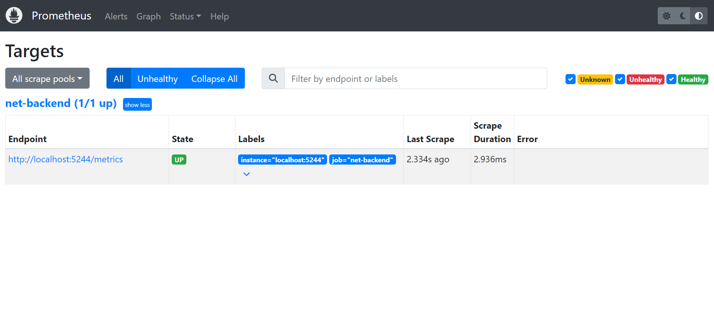
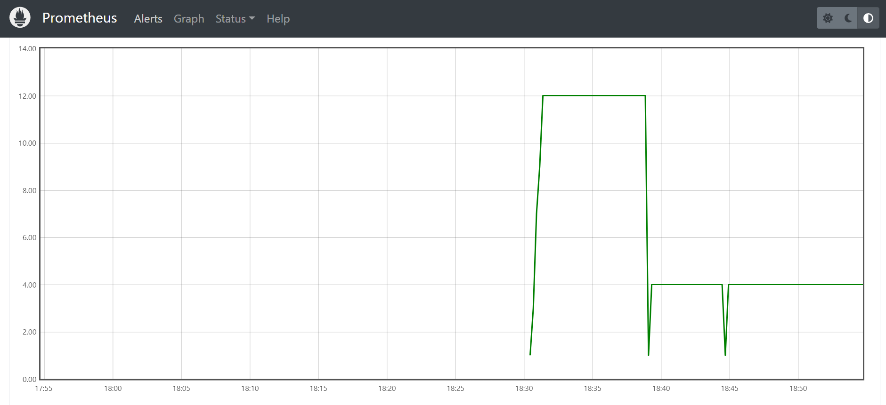
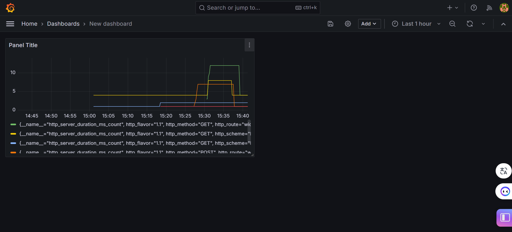
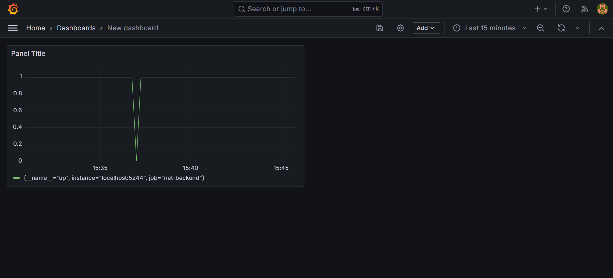

# Instrumentando a aplicação para a coleta de métricas 

### Prometheus:
Primeiro realizei o passo a passo de configurar o projeto para conectar com o prometheus, adicionando partes de código nos arquivos 'program.cs' e 'WidgetController.cs'

A seguir estão as imagens do prometheus em execução e coletando métricas do projeto: 

</img>

Na primeira imagem, você mostra a seção "Targets" do Prometheus. Isso confirma que seu serviço net-backend está rodando e disponível para o Prometheus na porta 5244, com a rota /metrics. O estado "UP" significa que a (scrape) das métricas está funcionando corretamente, e o Prometheus foi capaz de coletar métricas deste endpoint.

</img>

Na segunda imagem, há um gráfico do Prometheus exibindo uma métrica ao longo do tempo. As linhas verticais no gráfico indicam que houve variações na métrica que está sendo medida. 

Usando o Prometheus, configurei um monitoramento contínuo do serviço net-backend. O Prometheus está configurado para realizar a coleta de métricas a cada 15 segundos, como evidenciado pelo estado 'UP' no painel de targets. A métrica visualizada no gráfico demonstra variações significativas em intervalos regulares, indicando possíveis eventos de interesse, como picos de demanda ou erros intermitentes. Isso ressalta a importância de monitoramento contínuo para identificar e reagir rapidamente a problemas operacionais e de desempenho."

### Grafana:

No grafana escolhi usar duas métricas diferentes para gerar o gráfico, "http_server_duration_ms_count", e gerou o gráfico que está na imagem a seguir

</img>

E também utilizei a métrica, "greetings_count" e gerou o gráfico que está a seguir:

</img>

Ambos geraram gráficos de barras que estão expondo as métricas do projeto. 

- Prometheus: Sistema de monitoramento e alerta de código aberto, projetado para coletar e processar métricas em tempo real através de um modelo de dados multidimensional com uma linguagem de consulta flexível.
- Grafana: Plataforma analítica e de visualização para métricas e dados, que oferece painéis e gráficos ricos e interativos para explorar e exibir dados de várias fontes como Prometheus.

### Aprendizados
Utilizar Prometheus e Grafana em conjunto fornece uma solução poderosa para monitoramento e análise de desempenho, oferecendo insights detalhados e em tempo real, que auxiliam na detecção precoce de problemas, otimização de desempenho e na tomada de decisões baseadas em dados para aplicações.  
Ao analisar os dados coletados, você pode identificar padrões de tráfego, reconhecer gargalos de desempenho, entender a frequência e a gravidade dos erros e ajustar recursos de sistema para melhorar o desempenho.

